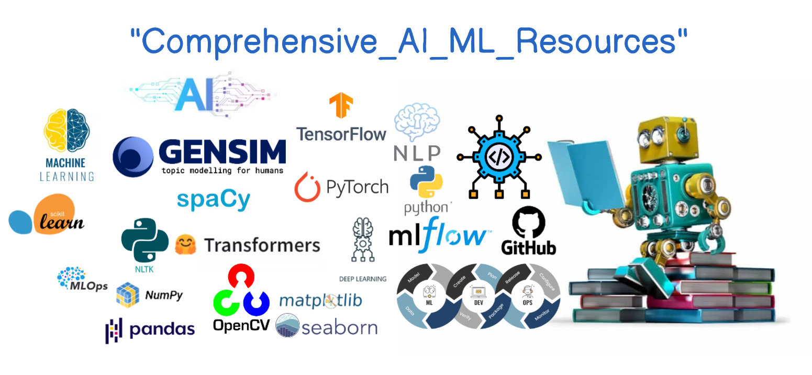

<h1 align="center">🌟 Comprehensive AI/ML Resources📚 🌟</h1>

  
  
  
  

  

  <strong>🚀 A Complete AI/ML Repository with in-depth coverage of <code>Math</code>, <code>Python</code>, <code>Machine Learning</code>, <code>Deep Learning</code>, <code>NLP</code>, <code>Computer Vision</code>, <code>LLMs</code>, <code>LLMs</code>, <code>MLOps</code>, and <code>End To End Projects</code> 🚀</strong>

---

## 📑 Table of Contents
| Section | Description |
|---------|-------------|
| [01. Math for AI and ML](https://github.com/FraidoonOmarzai/Comprehensive_AI_ML_RESOURCES/tree/main/01_math) | Math foundations for AI/ML like linear algebra, calculus, statistic and probability. |
| [02. Python](https://github.com/FraidoonOmarzai/Comprehensive_AI_ML_RESOURCES/tree/main/02_Python) | Python fundamentals, data structures, libraries, and more. |
| [03. Machine Learning](https://github.com/FraidoonOmarzai/Comprehensive_AI_ML_RESOURCES/tree/main/03_ML) | Core ML algorithms, models, techniques, and much more. |
| [04. Deep Learning](https://github.com/FraidoonOmarzai/Comprehensive_AI_ML_RESOURCES/tree/main/04_DL) | Dive into ANN, CNN, RNN, LSTM, and more. |
| [05. NLP](https://github.com/FraidoonOmarzai/Comprehensive_AI_ML_RESOURCES/tree/main/05_NLP) | Natural Language Processing using ML and DL models, preprocessing techniques, tools in NLP, and more. |
| [06. Computer Vision](https://github.com/FraidoonOmarzai/Comprehensive_AI_ML_RESOURCES/tree/main/06_CV) | Introduction to CV, Object detection, GANs, image segmentation, and OpenCV. |
| [07. Generative AI & LLMs](https://github.com/FraidoonOmarzai/Comprehensive_AI_ML_RESOURCES/tree/main/07_LLM) | Explore the world of Large Language Models and Generative AI. |
| [08. Agentic AI](https://github.com/FraidoonOmarzai/Comprehensive_AI_ML_RESOURCES/tree/main/08_AgenticAI) | Dive deep into Agentic AI and Automation. |
| [09. MLOps](#09-mlops-resources-️) | Tools, courses, and resources for MLOps. |
| [10. End-To-End Projects. Generative AI & LLMs](#10-end-to-end-projects-) | Comprehensive end-to-end projects. |

---

## 01. Math for AI and ML 📐

1. [**Linear Algebra**](https://github.com/FraidoonOmarzai/Comprehensive_AI_ML_RESOURCES/blob/main/01_math/01_linear_algebra.ipynb)
   - Introduction, System of Equations, Matrix Operations, Eigenvalues & Eigenvectors, and more.

2. [**Calculus**](https://github.com/FraidoonOmarzai/Comprehensive_AI_ML_RESOURCES/blob/main/01_math/02_calculus.ipynb)
   - Limits, Derivatives, Chain Rules, Partial Derivatives, etc.

3. [**Probability**](https://github.com/FraidoonOmarzai/Comprehensive_AI_ML_RESOURCES/blob/main/01_math/03_probability.ipynb)
   - Introduction to Probability, Bayes Theorem, Permutations, Probability Distribution, etc.

4. [**Statistics**](https://github.com/FraidoonOmarzai/Comprehensive_AI_ML_RESOURCES/blob/main/01_math/04_statistics.ipynb)
   - Central Tendency, Hypothesis Testing, Plots (Box, QQ, Violin), and more.
---

## 02. Python 🐍

1. [**Python Basics**](https://github.com/FraidoonOmarzai/Comprehensive_AI_ML_RESOURCES/blob/main/02_Python/01_python.ipynb)
   - Variables, Data Types, Lists, Functions, OOP, Error Handling, etc.

2. [**Data Structures & Algorithms**](https://github.com/FraidoonOmarzai/Comprehensive_AI_ML_RESOURCES/blob/main/02_Python/02_data_structure_alg.ipynb)
   - Arrays, Sorting, Searching, Linked Lists, Trees, Graphs, and more.

3. [**NumPy**](https://github.com/FraidoonOmarzai/Comprehensive_AI_ML_RESOURCES/blob/main/02_Python/03_numpy.ipynb) | [**Pandas**](https://github.com/FraidoonOmarzai/Comprehensive_AI_ML_RESOURCES/blob/main/02_Python/04_pandas.ipynb) | [**Matplotlib**](https://github.com/FraidoonOmarzai/Comprehensive_AI_ML_RESOURCES/blob/main/02_Python/05_matplotlib.ipynb) | [**Seaborn**](https://github.com/FraidoonOmarzai/Comprehensive_AI_ML_RESOURCES/blob/main/02_Python/06_seaborn.ipynb)

---

## 03. Machine Learning 🤖

| 📂 **Topic**                      | 📑 **Link to Notebook** |
|------------------------------------|-------------------------|
| **1. Introduction To ML**          | [🌐 Notebook](https://github.com/FraidoonOmarzai/Comprehensive_AI_ML_RESOURCES/blob/main/03_ML/01_introduction.ipynb) |
| **2. Linear Regression**           | [🌐 Notebook](https://github.com/FraidoonOmarzai/Comprehensive_AI_ML_RESOURCES/blob/main/03_ML/02_linear_regression.ipynb) |
| **3. Logistic Regression**         | [🌐 Notebook](https://github.com/FraidoonOmarzai/Comprehensive_AI_ML_RESOURCES/blob/main/03_ML/03_logistic_regression.ipynb) |
| **4. Decision Tree**               | [🌐 Notebook](https://github.com/FraidoonOmarzai/Comprehensive_AI_ML_RESOURCES/blob/main/03_ML/04_decision_tree.ipynb) |
| **5. SVM**                         | [🌐 Notebook](https://github.com/FraidoonOmarzai/Comprehensive_AI_ML_RESOURCES/blob/main/03_ML/05_svm.ipynb) |
| **6. Naive Bayes**                 | [🌐 Notebook](https://github.com/FraidoonOmarzai/Comprehensive_AI_ML_RESOURCES/blob/main/03_ML/06_naive_bayes.ipynb) |
| **7. KNN**                         | [🌐 Notebook](https://github.com/FraidoonOmarzai/Comprehensive_AI_ML_RESOURCES/blob/main/03_ML/07_knn.ipynb) |
| **8. k-means Clustering**          | [🌐 Notebook](https://github.com/FraidoonOmarzai/Comprehensive_AI_ML_RESOURCES/blob/main/03_ML/08_k-means_clustering.ipynb) |
| **9. Hierarchical Clustering**     | [🌐 Notebook](https://github.com/FraidoonOmarzai/Comprehensive_AI_ML_RESOURCES/blob/main/03_ML/09_hierarchical_clustering.ipynb) |
| **10. DBSCAN**                     | [🌐 Notebook](https://github.com/FraidoonOmarzai/Comprehensive_AI_ML_RESOURCES/blob/main/03_ML/10_DBSCAN.ipynb) |
| **11. PCA**                        | [🌐 Notebook](https://github.com/FraidoonOmarzai/Comprehensive_AI_ML_RESOURCES/blob/main/03_ML/11_PCA.ipynb) |
| **12. LDA**                        | [🌐 Notebook](https://github.com/FraidoonOmarzai/Comprehensive_AI_ML_RESOURCES/blob/main/03_ML/12_LDA.ipynb) |
| **13. Ensemble Learning**          | [🌐 Notebook](https://github.com/FraidoonOmarzai/Comprehensive_AI_ML_RESOURCES/blob/main/03_ML/13_ensemble_learning.ipynb) |
| **14. Random Forest**              | [🌐 Notebook](https://github.com/FraidoonOmarzai/Comprehensive_AI_ML_RESOURCES/blob/main/03_ML/14_Random_Forest.ipynb) |
| **15. Gradient Boost**             | [🌐 Notebook](https://github.com/FraidoonOmarzai/Comprehensive_AI_ML_RESOURCES/blob/main/03_ML/15_gradient_boost.ipynb) |
| **16. XGBoost Regression**         | [🌐 Notebook](https://github.com/FraidoonOmarzai/Comprehensive_AI_ML_RESOURCES/blob/main/03_ML/16_xgboost_Regression.ipynb) |
| **17. XGBoost Classification**     | [🌐 Notebook](https://github.com/FraidoonOmarzai/Comprehensive_AI_ML_RESOURCES/blob/main/03_ML/17_xgboost_classification.ipynb) |
| **18. Adaboost**                   | [🌐 Notebook](https://github.com/FraidoonOmarzai/Comprehensive_AI_ML_RESOURCES/blob/main/03_ML/18_adaboost.ipynb) |
| **19. Regression Metrics**         | [🌐 Notebook](https://github.com/FraidoonOmarzai/Comprehensive_AI_ML_RESOURCES/blob/main/03_ML/19_regression_metrics.ipynb) |
| **20. Classification Metrics**     | [🌐 Notebook](https://github.com/FraidoonOmarzai/Comprehensive_AI_ML_RESOURCES/blob/main/03_ML/20_classification_metrics.ipynb) |
| **21. Lasso And Ridge Regression** | [🌐 Notebook](https://github.com/FraidoonOmarzai/Comprehensive_AI_ML_RESOURCES/blob/main/03_ML/21_lasso_ridge_regression.ipynb) |
| **22. Hyperparameter Tuning & Cross Validation** | [🌐 Notebook](https://github.com/FraidoonOmarzai/Comprehensive_AI_ML_RESOURCES/blob/main/03_ML/22_hyperparameters_tunning_cross_validation.ipynb) |
| **23. ML Project Life-cycle**      | [🌐 Notebook](https://github.com/FraidoonOmarzai/Comprehensive_AI_ML_RESOURCES/blob/main/03_ML/23_ml_ds_project_life_cycle.ipynb) |

---

## 04. Deep Learning 🧠

| 📂 **Topic**                      | 📑 **Link to Notebook** |
|------------------------------------|-------------------------|
| **1. Introduction To DL** | [🌐 Notebook](https://github.com/FraidoonOmarzai/Comprehensive_AI_ML_RESOURCES/blob/main/04_DL/01_Introduction.ipynb) |
| **2. ANN** | [🌐 Notebook](https://github.com/FraidoonOmarzai/Comprehensive_AI_ML_RESOURCES/blob/main/04_DL/02_ANN.ipynb) |
| **3. Activation Functions** | [🌐 Notebook](https://github.com/FraidoonOmarzai/Comprehensive_AI_ML_RESOURCES/blob/main/04_DL/03_activation_fun.ipynb) |
| **4. Loss Functions** | [🌐 Notebook](https://github.com/FraidoonOmarzai/Comprehensive_AI_ML_RESOURCES/blob/main/04_DL/04_loss_fun.ipynb) |
| **5. Optimization**| [🌐 Notebook](https://github.com/FraidoonOmarzai/Comprehensive_AI_ML_RESOURCES/blob/main/04_DL/05_optimization.ipynb) |
| **6. Vanishing Explodings** | [🌐 Notebook](https://github.com/FraidoonOmarzai/Comprehensive_AI_ML_RESOURCES/blob/main/04_DL/06_vanishing_explodings.ipynb) |
| **7. Overfit And Uderfit** | [🌐 Notebook](https://github.com/FraidoonOmarzai/Comprehensive_AI_ML_RESOURCES/blob/main/04_DL/07_overfit_underfit.ipynb) |
| **8. CNN**             | [🌐 Notebook](https://github.com/FraidoonOmarzai/Comprehensive_AI_ML_RESOURCES/blob/main/04_DL/08_CNN.ipynb) |
| **9. CNN Architectures** | [🌐 Notebook](https://github.com/FraidoonOmarzai/Comprehensive_AI_ML_RESOURCES/blob/main/04_DL/09_CNN_architectures.ipynb) |
| **10. RNN** | [🌐 Notebook](https://github.com/FraidoonOmarzai/Comprehensive_AI_ML_RESOURCES/blob/main/04_DL/10_RNN.ipynb) |
| **11. LSTM And GRU** | [🌐 Notebook](https://github.com/FraidoonOmarzai/Comprehensive_AI_ML_RESOURCES/blob/main/04_DL/11_LSTM_GRU.ipynb) |
| **12. BRNN** | [🌐 Notebook](https://github.com/FraidoonOmarzai/Comprehensive_AI_ML_RESOURCES/blob/main/04_DL/12_BRNN.ipynb) |
| **13. Tensorflow And PyTorch** | [🌐 Notebook](https://github.com/FraidoonOmarzai/Comprehensive_AI_ML_RESOURCES/blob/main/04_DL/13_TF_PyTorch.ipynb) |

---

## 05. Natural Language Processing (NLP) 💬
| 📂 **Topic**                      | 📑 **Link to Notebook** |
|------------------------------------|-------------------------|
| **1. Introduction To NLP** | [🌐 Notebook](https://github.com/FraidoonOmarzai/Comprehensive_AI_ML_RESOURCES/blob/main/05_NLP/01_introduction_to_NLP.ipynb) |
| **2. Word Embeddings** | [🌐 Notebook](https://github.com/FraidoonOmarzai/Comprehensive_AI_ML_RESOURCES/blob/main/05_NLP/02_word_embeddings.ipynb) |
| **3. Word2vec**  | [🌐 Notebook](https://github.com/FraidoonOmarzai/Comprehensive_AI_ML_RESOURCES/blob/main/05_NLP/03_word2vec.ipynb) |
| **4. Seq2Seq**  | [🌐 Notebook](https://github.com/FraidoonOmarzai/Comprehensive_AI_ML_RESOURCES/blob/main/05_NLP/04_seq2seq.ipynb) |
| **5. Transformers**  | [🌐 Notebook](https://github.com/FraidoonOmarzai/Comprehensive_AI_ML_RESOURCES/blob/main/05_NLP/05_transformers.ipynb) |
| **6. DL Models In NLP**  | [🌐 Notebook](https://github.com/FraidoonOmarzai/Comprehensive_AI_ML_RESOURCES/blob/main/05_NLP/06_DL_models_NLP.ipynb) |

---

## 06. Computer Vision (CV) 👁️

| 📂 **Topic**                      | 📑 **Link to Notebook** |
|------------------------------------|-------------------------|
| **1. Introduction To CV**         | [🌐 Notebook](https://github.com/FraidoonOmarzai/Comprehensive_AI_ML_RESOURCES/blob/main/06_CV/01_introduction_to_CV.ipynb) |
| **2. Object Detection**     | [🌐 Notebook](https://github.com/FraidoonOmarzai/Comprehensive_AI_ML_RESOURCES/blob/main/06_CV/02_object_detection.ipynb) |
| **3. OpenCV**                        | [🌐 Notebook](https://github.com/FraidoonOmarzai/Comprehensive_AI_ML_RESOURCES/blob/main/06_CV/03_opencv.ipynb) |
| **4. GAN**                        | [🌐 Notebook](https://github.com/FraidoonOmarzai/Comprehensive_AI_ML_RESOURCES/blob/main/06_CV/04_GANs.ipynb) |
| **5. Image Segmentation**                        | [🌐 Notebook](https://github.com/FraidoonOmarzai/Comprehensive_AI_ML_RESOURCES/blob/main/06_CV/05_image_segmentation.ipynb) |

---

## 07. Generative AI & LLMs 📝

| 📂 **Topic**                      | 📑 **Link to Notebook** |
|------------------------------------|-------------------------|
| **1. Introduction to Generative AI & LLMs**         | [🌐 Notebook](https://github.com/FraidoonOmarzai/Comprehensive_AI_ML_RESOURCES/blob/main/07_LLM/01_Introduction_GenerativeAI_llm.ipynb) |
| **2. Retrieval-Augmented Generation (RAG)**     | [🌐 Notebook](https://github.com/FraidoonOmarzai/Comprehensive_AI_ML_RESOURCES/blob/main/07_LLM/02_RAG.ipynb) |
| **3. Revealing the training secret of DeepSeek**     | [🌐 Notebook](https://github.com/FraidoonOmarzai/Comprehensive_AI_ML_RESOURCES/blob/main/07_LLM/03_Revealing_Training_SecretOf_DeepSeek.ipynb) |

---

## 08. Agentic AI 🦾

| 📂 **Topic**                      | 📑 **Link to Notebook** |
|------------------------------------|-------------------------|
| **1. Introduction to Agentic AI**         | [🌐 Notebook](https://github.com/FraidoonOmarzai/Comprehensive_AI_ML_RESOURCES/blob/main/08_AgenticAI/01_Introduction_To_AgenticAI.ipynb) |

---

## 09. MLOps Resources ⚙️

1. Github: [Github](https://docs.github.com/en/get-started/start-your-journey/git-and-github-learning-resources) | 
2. Docker: [Docker Tutorial for Beginners (TechWorld with Nana)](https://www.youtube.com/watch?v=3c-iBn73dDE&ab_channel=TechWorldwithNana) | [End To End Machine Learning Project Implementation With Dockers (Krish Naik)](https://www.youtube.com/watch?v=MJ1vWb1rGwM&ab_channel=KrishNaik)
3. MLFlow: [MLflow in Machine Learning ](https://www.youtube.com/watch?v=r0do1KVEGqM&list=PLwFaZuSL_mfou923msxLWAqxkj6Zcnt29&ab_channel=AshutoshTripathi)
4. CI/CD: [GitHub Actions Tutorial (TechWorld with Nana)](https://www.youtube.com/watch?v=R8_veQiYBjI&t=13s&ab_channel=TechWorldwithNana) | [GitHub Actions (glich.stream)](https://www.youtube.com/watch?v=-hVG9z0fCac&list=PLArH6NjfKsUhvGHrpag7SuPumMzQRhUKY&ab_channel=glich.stream)
5. Kubernete: [Kubernetes Tutorial for Beginners (TechWorld with Nana)](https://www.youtube.com/watch?v=X48VuDVv0do&t=2s&ab_channel=TechWorldwithNana)

6. AWS: [AWS Cloud Practitioner (Udemy)](https://www.udemy.com/course/aws-certified-cloud-practitioner-new/)

### MLOps Courses:
| Platform | Links |
|----------|-------|
| ⚙️ Coursera | [MLOps Specialization](https://www.coursera.org/learn/introduction-to-machine-learning-in-production) |
| ⚙️ Udemy | [Machine Learning Specialty](https://www.udemy.com/course/aws-machine-learning/?couponCode=SEP_24_GET_STARTED) |

---

## 10. End-To-End Projects 🥷🏻

| 📂 **Topic**                      | 📑 **Link to Github Repository** |
|------------------------------------|-------------------------|
| **1. End-To-End ML Project (Liver Disease)**    | [🔗 Github](https://github.com/FraidoonOmarzai/end-to-end-liver-project) |
| **2. End-To-End NLP Project (Hate Speech Detection)**    | [🔗 Github](https://github.com/FraidoonOmarzai/hate-speech-end-to-end-project) |
| **3. End-To-End DL/Computer Vision Project (Medical Image Analysis)**    | [🔗 Github](https://github.com/FraidoonOmarzai/Medical-Image-Analysis) |
| **4. End-To-End LLM Project(Medical Chatbot)**    | [🔗 Github](https://github.com/FraidoonOmarzai/Medical-Chatbot-LLM) |
| **5. End-To-End RAG Project (Corrective RAG)**    | [🔗 Github](https://github.com/FraidoonOmarzai/CorrectiveRAG) |
| **6. End-To-End MLOps Project**    | [🔗 Github](https://github.com/FraidoonOmarzai/End-To-End-MLOps-Project) |
---

## 🌟 Connect with Me

  
  
  

---

  Repository created and maintained by <a href="https://github.com/FraidoonOmarzai">Fraidoon Omarzai</a>

---

> **If you find this repository helpful, don't forget to give it a ⭐!**